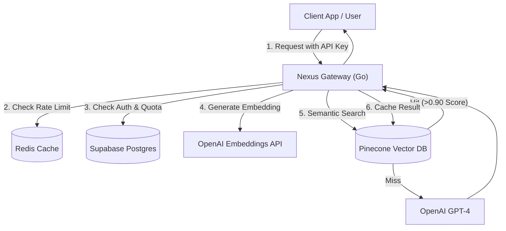

#  Nexus Gateway
### High-Performance AI Semantic Caching & Monetization Layer

[Live Demo](https://nexus-frontend-rlekpcxos-sunny-anands-projects.vercel.app/) · [Report Bug](https://github.com/ANANDSUNNY0899/NexusGateway/issues) · [Request Feature](https://github.com/ANANDSUNNY0899/NexusGateway/issues)

---

##  Overview

**Nexus Gateway** is an intelligent middleware designed to sit between your users and Large Language Models (LLMs) like OpenAI. It solves the three biggest problems in AI Engineering today: **Cost, Latency, and Scalability.**

By using **Vector Embeddings (OpenAI text-embedding-3)** and **Cosine Similarity Search**, Nexus understands the *context* of a user's question. If a similar question has been asked before, it serves the cached response instantly from **Pinecone/Redis**, bypassing the expensive LLM call entirely.

---

##  Key Features

###  Performance & Cost
- **Semantic Caching:** Recognizes that "How do I make tea?" and "Recipe for tea" are the same question. Serves cached answers in **<50ms**.
- **Multi-Layer Storage:** Hot cache in **Redis** (L1) and Vector storage in **Pinecone** (L2).
- **Cost Reduction:** Proven to reduce OpenAI token usage by up to **90%** for repetitive workloads.

###  Security & Scalability
- **Rate Limiting:** Token-bucket algorithm (Redis) to prevent abuse (e.g., 100 requests/limit).
- **Multi-Tenant Auth:** Secure user management via **Supabase (PostgreSQL)**. Users generate their own `nk-` API keys.
- **Stateless Architecture:** Fully containerized Go binary deployed on **Render Cloud**.

###  Monetization (SaaS Ready)
- **Automated Billing:** Integrated **Stripe Checkout** for plan upgrades.
- **Webhooks:** Real-time account upgrades via Stripe Webhooks.
- **Usage Tracking:** Tracks every token and request per user.

---

## 🛠️ System Architecture

```mermaid
graph TD
    User["Client App / User"] -->|1. Request with API Key| Go["Nexus Gateway (Go)"]
    Go -->|2. Check Rate Limit| Redis[("Redis Cache")]
    Go -->|3. Check Auth & Quota| DB[("Supabase Postgres")]
    
    Go -->|4. Generate Embedding| OAI["OpenAI Embeddings API"]
    
    Go -->|5. Semantic Search| Pine[("Pinecone Vector DB")]
    
    Pine -- "Hit (>0.90 Score)" --> Go
    Pine -- Miss --> LLM["OpenAI GPT-4"]
    
    LLM --> Go
    Go -->|6. Cache Result| Pine
    Go --> User
```
 

## Getting Started 
Prerequisites 
 * Go 1.21+ 
 * Redis Instance (Upstash/Local) 
 * PostgreSQL (Supabase/Local) 
 * API Keys (OpenAI, Pinecone, Stripe) 
 
## Installation 
1. Clone the Repo 
    git clone https://github.com/ANANDSUNNY0899/NexusGateway.git 
    cd NexusGateway 
2. Setup Environment 
   Create a .env file or set variables in your terminal: 
        export OPENAI_API_KEY="sk-..." 
        export REDIS_URL="rediss://..." 
        export PINECONE_API_KEY="pcsk_..." 
        export PINECONE_HOST="index-name.svc.pinecone.io" 
        export DB_URL="postgresql://..." 
        export STRIPE_SECRET_KEY="sk_test_..." 
3. Run the Server: 
     go run main.go 
 
# API Endpoints 
        * Method	Endpoint	Description	Auth Required 
        * POST	/api/register	Create a new user & get API Key	❌ No 
        * POST	/api/chat	Send prompt to AI (Cached)	✅ Yes 
        * POST	/api/checkout	Generate Stripe Payment Link	✅ Yes 
        * GET	/api/stats	View global savings stats	❌ No 
  
# Future Roadmap 
        * Multi-Model Support: Route to Anthropic/Claude and Google Gemini. 
        * Dashboard V2: Visual charts for usage history. 
        * SDK: Python and Node.js wrappers for easier integration. 
# Built with ❤️ by Sunny Anand 
