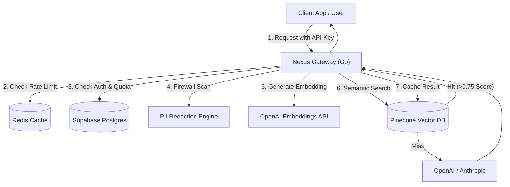

<div align="center">


#  Nexus Gateway
### High-Performance AI Semantic Caching & Monetization Layer
One line of code to reduce LLM latency by 95%, costs by 90%, and enforce data privacy.


[](https://badge.fury.io/py/nexus-gateway)
[](https://www.npmjs.com/package/nexus-gateway-js)
[](https://opensource.org/licenses/MIT)

[Live Demo](https://nexus-gateway.org) · [Report Bug](https://github.com/ANANDSUNNY0899/NexusGateway/issues) · [Request Feature](https://github.com/ANANDSUNNY0899/NexusGateway/issues)

</div>

---

## ⚡ Why Nexus Gateway?

| Metric | Legacy API Call | **Nexus Gateway** |
| :--- | :--- | :--- |
| **Response Latency** | 1200ms - 3000ms | **5ms (Cache Hit)** |
| **Data Privacy** | Sent to Provider | **Redacted at Edge** |
| **Unit Cost** | $0.01 - $0.05 / call | **$0.00 (Cache Hit)** |
| **Reliability** | Vendor Dependent | **Self-Healing Failover** |

---

## 🔍 X-Ray Deep Observability
Stop calling AI blindly. Nexus provides a real-time **Trace Inspector** with X-Ray vision into every request payload, response text, and financial saving.

*   **Sovereign Shield:** Automatically redact PII (Emails, IDs) before it leaves your server.
*   **Adaptive Discovery:** Automatically heals 404 errors by mapping working model engines to your API keys.

---

##  Overview

**Nexus Gateway** is an intelligent middleware designed to sit between your users and Large Language Models (LLMs) like OpenAI. It solves the three biggest problems in AI Engineering today: **Cost, Latency, and Scalability.**

By using **Vector Embeddings (OpenAI text-embedding-3)** and **Cosine Similarity Search**, Nexus understands the *context* of a user's question. If a similar question has been asked before, it serves the cached response instantly from **Pinecone/Redis**, bypassing the expensive LLM call entirely.

---

##  Key Features

###  Performance & Cost
- **Semantic Caching:** Recognizes that "How do I make tea?" and "Recipe for tea" are the same question. Serves cached answers in **<50ms**.
- **Universal Router:** Dynamically switches between **GPT-4** and **Claude 3** based on user payload.
- **Streaming Support:** Full Server-Sent Events (SSE) support for real-time typing effect.

###  Security & Privacy
- **PII Firewall:** Automatically redacts sensitive data (Emails, Phone Numbers) before sending prompts to OpenAI.
- **Rate Limiting:** Token-bucket algorithm (Redis) to prevent abuse.
- **Multi-Tenant Auth:** Secure user management via **Supabase**.

###  Monetization (SaaS Ready)
- **Automated Billing:** Integrated **Stripe Checkout** for plan upgrades.
- **Webhooks:** Real-time account upgrades via Stripe Webhooks.
- **Usage Tracking:** Tracks every token and request per user.

---

##  System Architecture


```mermaid
graph TD
    User["Client App / User"] -->|1. Request with API Key| Go["Nexus Gateway (Go)"]
    Go -->|2. Check Rate Limit| Redis[("Redis Cache")]
    Go -->|3. Check Auth & Quota| DB[("Supabase Postgres")]
    
    Go -->|4. Firewall Scan| PII["PII Redaction Engine"]
    
    Go -->|5. Generate Embedding| OAI["OpenAI Embeddings API"]
    
    Go -->|6. Semantic Search| Pine[("Pinecone Vector DB")]
    
    Pine -- "Hit (>0.75 Score)" --> Go
    Pine -- Miss --> LLM["OpenAI / Anthropic"]
    
    LLM --> Go
    Go -->|7. Cache Result| Pine
    Go --> User
```
<br/>

# Getting Started
## Prerequisites
    * Go 1.21+
    * Redis Instance (Upstash/Local)
    * PostgreSQL (Supabase/Local)
    * API Keys (OpenAI, Pinecone, Stripe)

## Installation
1. Clone the Repo

```Bash
git clone https://github.com/ANANDSUNNY0899/NexusGateway.git
cd NexusGateway
```
#  You can install the official client via pip:

```Bash
pip install nexus-gateway
```
# You can install the official clinet via npm
```bash
npm install nexus-gateway-js
```

# Setup Environment
    ## Create a .env file or set variables in your terminal:

    export OPENAI_API_KEY="sk-..."
    export REDIS_URL="rediss://..."
    export PINECONE_API_KEY="pcsk_..."
    export PINECONE_HOST="index-name.svc.pinecone.io"
    export DB_URL="postgresql://..."
    export STRIPE_SECRET_KEY="sk_test_..."

3. Run the Server: 
```bash
   go run main.go
 ```

4. API Endpoints
    * Method	Endpoint	Description	Auth Required
    * POST	/api/register	Create a new user & get API Key	❌ No
    * POST	/api/chat	Send prompt to AI (Cached)	✅ Yes
    * POST	/api/checkout	Generate Stripe Payment Link	✅ Yes
    * GET	/api/stats	View global savings stats	❌ No

##  SDKs & Tools
   * Python SDK: pip install nexus-gateway (https://pypi.org/project/nexus-gateway/)
   * Node.js SDK: npm install nexus-gateway-js (https://www.npmjs.com/package/nexus-gateway-js)

##  Completed Roadmap

- [x] **v3.1 Sovereign Shield:** Deterministic PII Redaction & Data Governance.
- [x] **Adaptive Discovery:** Automated Failover for Gemini/Google API shifts.
- [x] **X-Ray Inspector: Full** payload transparency and trace auditing.
- [ ] **Organization Support:** Multi-tenant team accounts and shared quotas.
- [ ] **Smart Arbitrage:** Automatic model switching based on real-time token pricing.

---

### Built with ❤️ by Sunny Anand